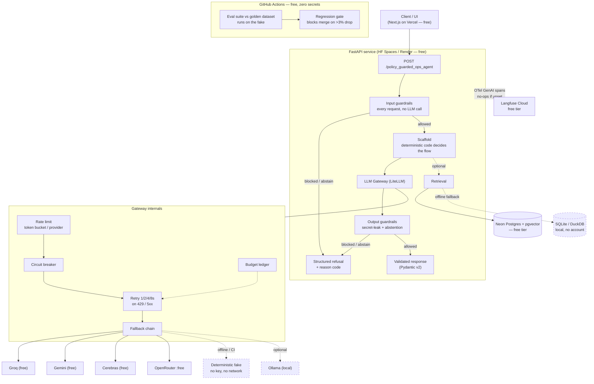

# policy-guarded-ops-agent

> **Placeholders:** `policy-guarded-ops-agent`, `policy_guarded_ops_agent`, `An AI operations agent whose business rules live in deterministic code, not in a prompt.`,
> `https://github.com/tmaslam/rulegate`, `https://rulegate.vvtechsol1.workers.dev`, `The LLM proposes. Code decides.`, and the
> `{{...}}` markers in the architecture/trade-off sections.
>
> **Rules for filling this in — read before typing a single number:**
> 1. Every value cell below reads `not yet run`. Replace a cell **only** with a
>    number a real run produced. Never estimate, never illustrate, never round a
>    number you remember.
> 2. Any score must ship with: dataset+sha, split, metric, model+version, temp,
>    seed, scaffold, cost, p50/p95 latency, 95% CI. `EvalReport.render_markdown()`
>    emits that block — copy it, don't retype it.
> 3. A run against the deterministic fake is **scaffold-only**. It is not
>    evidence about a model. Do not promote it into the eval table.
> 4. Never imply this was paid client work. It is a demo build.
> 5. Delete this block when you're done.

The LLM proposes. Code decides.

**Live demo:** https://rulegate.vvtechsol1.workers.dev · **Source:** https://github.com/tmaslam/rulegate

> **This is a demonstration project, not client work.** It is built to
> production patterns — typed boundaries, real error handling, versioned evals,
> guardrails, tracing — so the engineering is reviewable end to end. It runs at
> **$0.00**: every dependency is a free tier that needs no credit card.

---

## Quickstart — no API key, no accounts, no network

```bash
git clone https://github.com/tmaslam/rulegate && cd policy-guarded-ops-agent
make demo
```

That's it. There is **no `.env` to fill in** and nothing to sign up for. With no
keys set, the app resolves to a deterministic fake LLM, tracing no-ops, and the
database falls back to local SQLite. The demo is offline and reproducible.

`make demo` is designed to finish in **under two minutes**; the dominant cost is
the one-time `uv sync` dependency download, so a warm cache is much faster. It
downloads no models and no datasets.

To exercise the **live** path, copy `.env.example` to `.env` and add any one free
key (Groq is the fastest to obtain). Every var is commented with where to get it
free.

<details>
<summary>No <code>make</code> on Windows? Use the uv equivalents.</summary>

GNU make is not installed by default on Windows and Git Bash does not ship it.
Nothing here is make-only:

| Target | Equivalent |
| --- | --- |
| `make demo` | `uv run python -m policy_guarded_ops_agent.demo` |
| `make test` | `uv run pytest -m "not live"` |
| `make eval` | `uv run python -m evals.harness run --dataset evals/datasets/golden.v1.jsonl --out evals/runs/head.json` |
| `make lint` | `uv run ruff check . && uv run ruff format --check . && uv run mypy` |

`uv` manages Python 3.12 itself — you do not need Python on PATH first.
</details>

---

## Architecture



**The load-bearing idea:** deterministic code does the work; the LLM only
decides. Routing, retry, validation, budget and guardrails are all plain Python.
That is what makes the system testable offline and its failures diagnosable.

---

## Evals

Golden dataset versioned in git **by content hash**, so every number is
attributable to exact bytes. Level-1 assertions are deterministic — no LLM judge
in the pass/fail path.

<!-- Copy rows from `EvalReport.render_markdown()`. Do not retype numbers. -->

| Dataset | Split | Metric | Model + version | Temp | Seed | Scaffold | Score (95% CI) | p50 / p95 latency | Cost/req |
| --- | --- | --- | --- | --- | --- | --- | --- | --- | --- |
| not yet run | not yet run | not yet run | not yet run | not yet run | not yet run | not yet run | not yet run | not yet run | not yet run |

**No eval has been run against a real model yet, so every cell reads
`not yet run`.** The harness, the dataset and the CI gate are implemented and
green against the deterministic fake — that proves the *scaffold*, and a
scaffold-only run is stamped as such by the reporter. It is deliberately not
promoted into this table, because it is not evidence about a model.

Scores are reported with a **Wilson 95% interval**, not a bare point estimate.
On a 50-case set, "0.86" is really 0.86 ± ~0.09; quoting the point alone
overstates what was measured. Wilson rather than the normal approximation
because the latter returns `[1.0, 1.0]` for 20/20 — claiming certainty from 20
samples.

### LLM-judge calibration

If a judge is used for any subjective metric, its precision/recall against
**human** labels is reported here. An uncalibrated judge is an unchecked
measuring instrument, and its output is not a number worth reporting.

| Judge model | n (human-labelled) | Precision (95% CI) | Recall (95% CI) | F1 | Accuracy | Cohen's κ |
| --- | --- | --- | --- | --- | --- | --- |
| not yet run | not yet run | not yet run | not yet run | not yet run | not yet run | not yet run |

κ is reported alongside accuracy because accuracy flatters a judge on an
unbalanced set: if 90% of answers are good, a judge that says "pass"
unconditionally scores 0.90 accuracy and κ = 0.00. (That is arithmetic, not a
measurement — it is what κ is *for*.)

```bash
make eval          # run the golden dataset (offline, deterministic fake)
make eval-compare  # base-vs-head comparison + regression gate
```

---

## How it fails

Every system fails. A portfolio piece that doesn't say how is hiding something.
These are the known failure modes, including the ones with no fix.

| Failure | What happens | Handling | Residual risk |
| --- | --- | --- | --- |
| **Prompt injection via retrieved content** | Attacker plants instructions in a document the retriever picks up. | Retrieved content is tagged untrusted and injection phrasings in it are blocked; the model gets no secrets and no arbitrary execution. | **Not solved.** Pattern matching is evadable by paraphrase/encoding. Real mitigation is least privilege (SECURITY.md LLM06). No bypass rate is claimed — none measured. |
| **All free providers rate-limit at once** | Every provider 429s; the chain is exhausted. | 1/2/4/8s jittered backoff per provider, then fail over; `AllProvidersFailedError` carries each cause. | Request fails. Free tiers have hard ceilings; there is no fourth option that is also free. Surfaced honestly rather than retried forever. |
| **Provider returns malformed JSON** | Structured output fails schema validation. | `StructuredOutputError` raised with the raw body attached. **No regex repair, no salvage pass.** | Request fails loudly. Deliberate: a silently "repaired" object is worse than a visible error. |
| **Model fabricates a citation** | Answer cites a chunk id that was never retrieved. | `GroundednessFilter` compares cited ids against retrieved ids and abstains. | Catches invented *sources*, not unsupported *claims* against a real source. That needs an eval, not a guardrail. |
| **Model is confidently wrong** | Fluent, plausible, false. | Abstention is first-class and countable; Level-1 assertions catch regressions on the golden set. | **The hardest one, and largely unsolved.** Detection is bounded by dataset coverage. |
| **Provider silently swaps model versions** | Free tiers re-route to different weights without notice. | The **resolved** model id is recorded on every response and in every report — not the requested alias. | A number from last month may not reproduce. This is why every reported figure carries model+version and a date. |
| **Circuit breaker opens on a healthy provider** | A burst of 5xx trips the breaker; traffic sheds to a slower fallback. | Half-open probe after the recovery window restores it automatically. | Brief degraded latency. Accepted: the alternative is 15s of retries per request against a dead provider. |
| **SQLite fallback masks a Postgres bug** | Offline dev path diverges from the Neon deploy path. | Both paths are exercised; vector search degrades to brute-force cosine, correct but slower. | A latency number from the SQLite path is **not** a Neon number and must never be reported as one. |
| **Eval score drifts on an unchanged prompt** | Provider-side model changes move the score. | The CI gate compares base vs head on an identical dataset hash and blocks a >3pt absolute drop. | The gate refuses to draw conclusions across differing dataset hashes — by design; that comparison would be meaningless. |
| **Fake-backed CI hides a live bug** | The suite is green; the live path is broken. | Acknowledged openly. CI proves the scaffold — routing, parsing, assertions — not the model. | **Real and accepted.** The alternative is a paid, flaky, rate-limited CI. Live checks are run manually and reported with full provenance. |

---

## Design trade-offs

Each of these is a real decision with a real cost.

**Free tiers over a paid API.** Zero cost and no credit card, at the price of
hard rate limits, no SLA, and providers that re-route models without notice.
Mitigated by a fallback chain and by recording the resolved model id on every
response. A production system with a budget would pin one provider and pay for it.

**A fallback chain over a single provider.** Survives one provider going down —
but different models produce different outputs, so a score is only meaningful per
model+version. That is exactly why the eval table has a model column, and why a
row without one is not reportable.

**Deterministic fake in CI over live calls.** Free, fast, reproducible, no quota.
It cannot catch a live-path break. Accepted openly and stated in the failure
table above; the alternative — a paid, flaky CI — is worse and violates the zero
cost constraint.

**Level-1 deterministic assertions over an LLM judge.** Exact, free, instant, no
calibration needed. They cannot assess nuance. A judge is added only where nuance
is genuinely required, and then only with published calibration against human
labels.

**Guardrails in the request path over batch-only evals.** Every request is
filtered, and it costs no extra LLM call because every filter is plain Python.
Heuristics have false positives; the injection filter therefore only *logs* on
direct user input and *blocks* on untrusted content — trading coverage for a much
lower false-refusal rate.

**Prompt caching where supported, dropped silently where not.** Cuts billable
input tokens on Gemini; a no-op on Groq/Cerebras. Caching is an optimisation, not
semantics, so dropping it is always safe.

**`uv` over pip/poetry.** Fast, lock-file reproducible, manages the interpreter
itself, so `make demo` works without Python pre-installed. Newer than pip, with a
smaller ecosystem of tutorials.

**SQLite fallback alongside Neon.** The repo runs offline with no account — worth
a lot for a reviewer cloning it cold. The cost is two code paths, and the risk
that a number from one gets reported as the other. Called out in the failure table.

---

## Project layout

```
policy-guarded-ops-agent/
├── src/policy_guarded_ops_agent/
│   ├── llm/gateway.py        # LiteLLM gateway: fallback, retry, breaker, budget
│   ├── obs/tracing.py        # OTel GenAI -> Langfuse; no-ops when unset
│   ├── guardrails/base.py    # per-request input/output filters + refusal path
│   ├── fakes/fake_llm.py     # deterministic fake — why CI is free
│   └── demo.py               # `make demo` entry point
├── evals/
│   ├── harness.py            # golden runner, Level-1 assertions, judge calibration
│   └── datasets/golden.v1.jsonl
├── tests/
├── .github/workflows/ci.yml  # ruff + mypy + pytest + evals + gate. Zero secrets.
├── Dockerfile                # multi-stage uv -> slim runtime, non-root
├── COST.md · SECURITY.md
└── pyproject.toml            # uv · ruff · mypy strict · pytest
```

## Development

```bash
make setup   # venv + deps + pre-commit hooks (uv installs Python 3.12 itself)
make check   # everything CI runs, in CI's order
make fmt     # auto-fix
```

Python 3.12 · `uv` · `ruff` · `mypy --strict` · `pytest` · Pydantic v2 at every
boundary.

## Cost

Runs at **$0.00**. Methodology and the (unmeasured) tables: [COST.md](./COST.md).

## Security

OWASP LLM Top 10 mapping, with LLM01 (prompt injection) and LLM06 (excessive
agency) treated seriously — including what is **not** mitigated:
[SECURITY.md](./SECURITY.md).

## License

MIT
